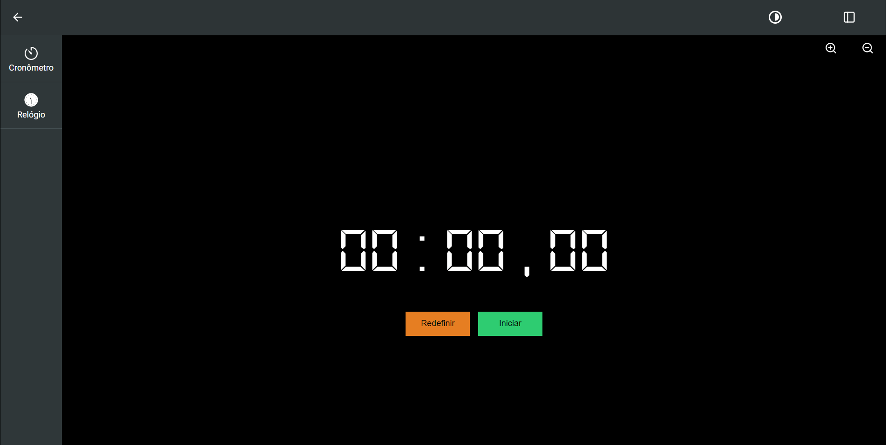

<h1 align='center'>Projeto Cronômetro</h1>

<h2 align='center'>

</h2>

<h2 align='center'>
    

        Projeto realizado com ReactJS e o Pré-processador CSS: SASS
    

</h2>

<h3>
<a href='https://cronometro.vercel.app'>Já esta no ar</a>
</h3>

Esse projeto tem como objetivo praticar  alguns conhecimentos já obtidos 
e também por em prática novos conceitos que venho estudando.

## ''... Start and Reset any time''

 

### Sinta-se livre para contribuir se achar necessário. Toda e qualquer ajuda é muito bem-vinda.
### <i>A troca de experiências e conhecimento é essencial para a evolução profissional.</i>
